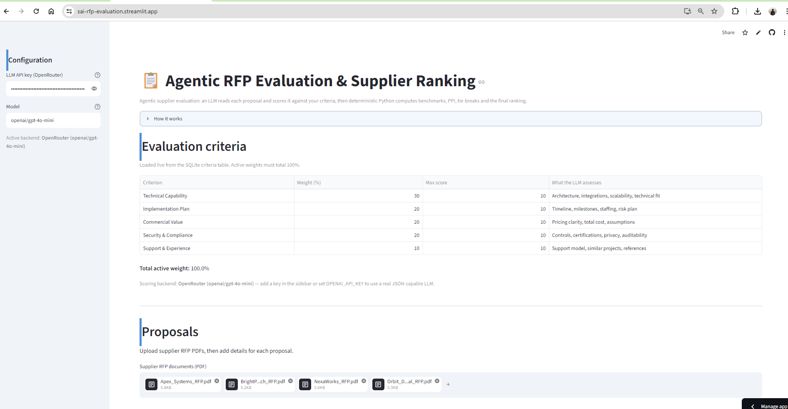
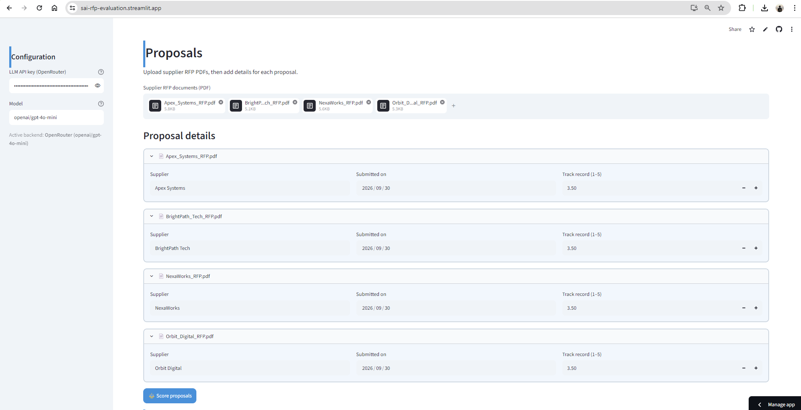
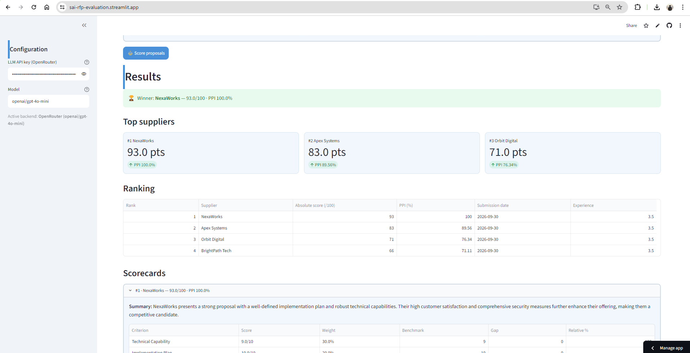
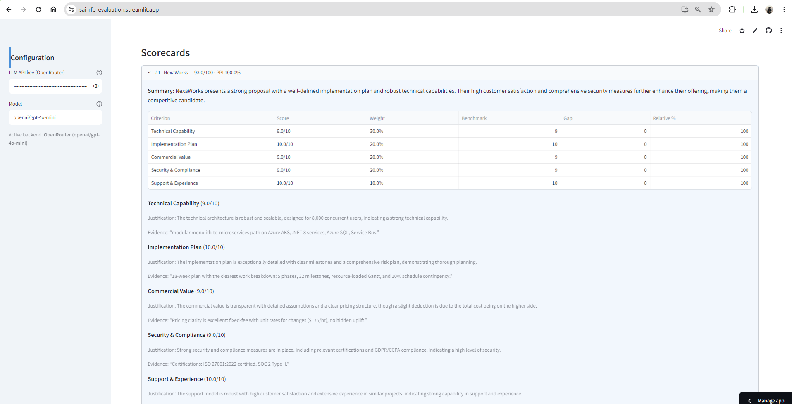
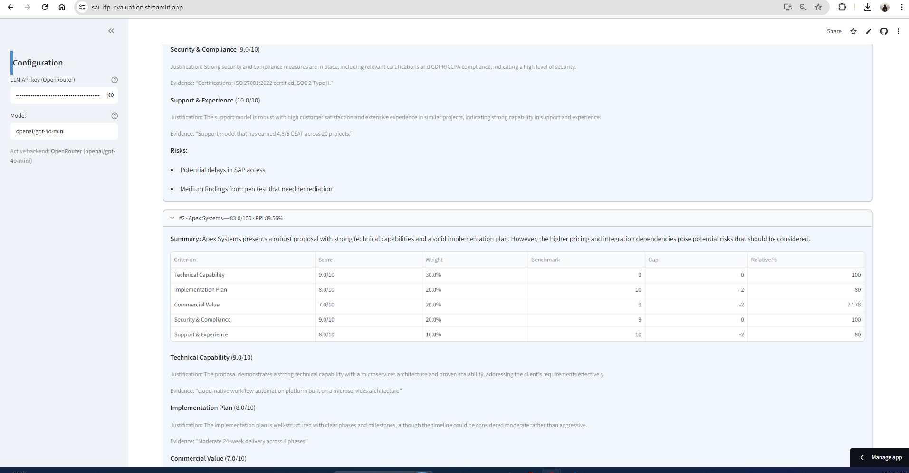
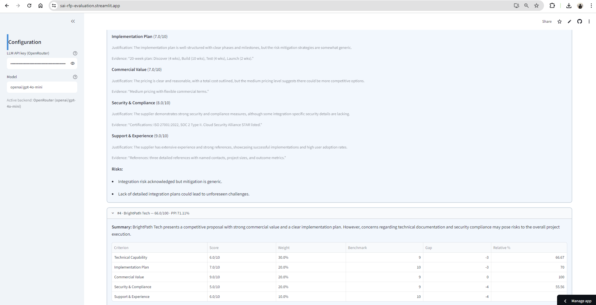
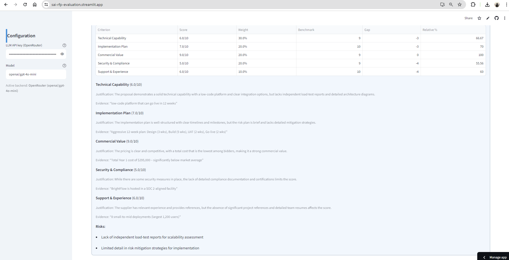
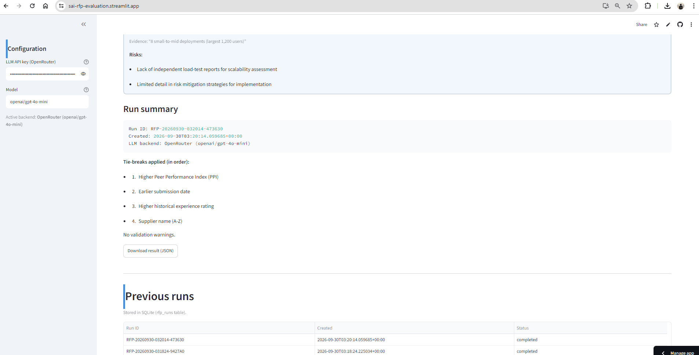

# Agentic RFP Evaluation & Supplier Ranking

AI-assisted app that reads supplier RFP PDFs, scores them against configurable criteria
with an LLM, then applies **deterministic** Python for benchmarks, Peer Performance
Index (PPI), tie-breaks, ranking, and SQLite persistence. Includes a Streamlit UI.

## Architecture

| Component | Responsibility |
|---|---|
| Orchestrator Agent (`tools/orchestrator.py`) | Controls workflow order, calls tools |
| Document Tool (`tools/document_tool.py`) | Extracts clean text from PDFs (pypdf) |
| Evaluation Agent (`tools/llm_client.py`) | Scores one supplier vs active criteria; evidence-grounded JSON |
| Validation Tool (`tools/validation_tool.py`) | Schema checks, fills missing criteria, clips out-of-range scores, records warnings |
| Ranking Tool (`tools/ranking_tool.py`) | Deterministic formulas, peer benchmarks, PPI, tie-breaks, ranks — **no LLM** |

Data flow: Streamlit → load criteria → upload PDFs + metadata → batch → extract →
prompt LLM → validate → absolute score → benchmark → PPI → tie-break rank →
persist (one `RFP_RUN_ID`) → leaderboard + scorecards + JSON download.

## Formulas

- **Absolute weighted score** = Σ (score / max_score × weight)
- **Benchmark** (per criterion) = highest valid score observed across suppliers
- **Gap** = supplier score − benchmark (≤ 0)
- **Relative %** = (supplier score / benchmark) × 100; if benchmark = 0 → 100.0
- **PPI** = Σ (relative % × weight) / Σ weights

**Tie-break order:** 1) higher PPI → 2) earlier submission date →
3) higher experience rating → 4) supplier name A–Z. Ranks 1..N assigned after stable sort.

## Setup

```bash
cd rfp-evaluation
pip install -r requirements.txt
python init_db.py            # creates rfp_evaluation.db + seeds criteria
streamlit run app.py
```

Optional: use a real LLM in either of two ways —
- paste your own key in the app's sidebar (**Settings → OpenRouter API Key**, model defaults to `openai/gpt-4o-mini`), or
- set `OPENAI_API_KEY` (and optionally `OPENAI_MODEL`, `OPENAI_BASE_URL`) as an env var / Streamlit secret.

The sidebar key takes precedence. Without any key, a deterministic keyword-heuristic **mock**
backend runs so the app is fully demoable offline.

## Synthetic data

Generate the four fictional supplier PDFs (or use the committed ones):

```bash
python generate_pdfs.py   # → data/sample_pdfs/*.pdf
```

| Supplier | Intended profile |
|---|---|
| Apex Systems | Strong technical + security, higher price, moderate schedule |
| BrightPath Tech | Lowest price, fastest timeline, weak compliance, limited experience |
| NexaWorks | Balanced; strongest implementation plan + support model |
| Orbit Digital | Strong experience/references; vague integration plan; medium pricing |

## SQLite

- `evaluation_criteria(criterion_id, name, description, weight, max_score, is_active)`
- `rfp_runs(rfp_run_id, created_at, status)`
- `supplier_results(rfp_run_id, supplier_name, submission_date, experience_rating, absolute_score, ppi, final_rank, result_json)`

Weights of active criteria must total 100% (validated at batch time).

## Testing

```bash
python test_run.py   # end-to-end mock run over the 4 sample PDFs + validation edge cases
```

## Screenshots (deployed app)

Captured from a live run scored by a real LLM via OpenRouter (`openai/gpt-4o-mini`) — see the "Active backend" indicator in the sidebar and the run summary.

Evaluation criteria loaded live from SQLite (weights total 100%):



Proposal upload and per-supplier metadata:



Results: winner banner, top-supplier cards, and ranked leaderboard:



Expanded scorecards with per-criterion evidence and justifications:









Run summary (run ID, LLM backend, tie-break order, JSON download) and previous runs persisted in SQLite:



## Deploy (Streamlit Community Cloud)

1. Push this folder to a GitHub repo.
2. On share.streamlit.io → New app → select repo, `app.py`.
3. Add `OPENAI_API_KEY` under Secrets (optional).
4. Submit the public URL.

## Assumptions

- PDFs are text-based (scanned images need OCR — out of scope, surfaced as an error).
- Experience rating is a 1.0–5.0 historical score entered by the user.
- Without an API key, a deterministic keyword-heuristic mock backend runs so the app is demoable offline; any JSON-capable LLM can be plugged in via the sidebar or `OPENAI_API_KEY`.
